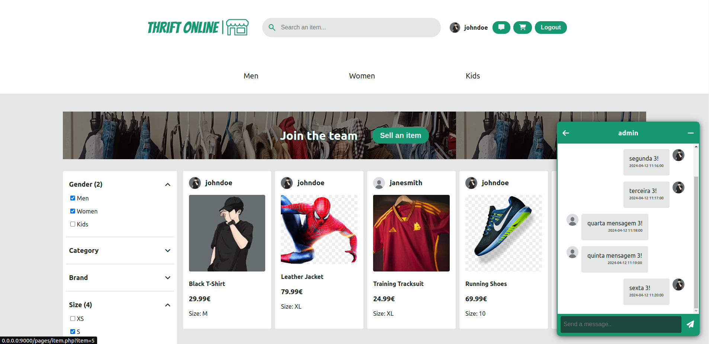
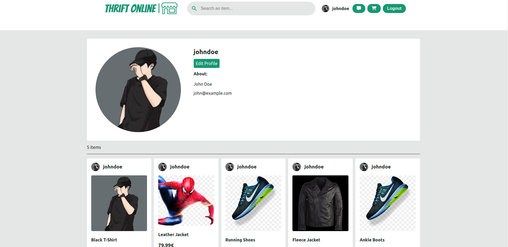
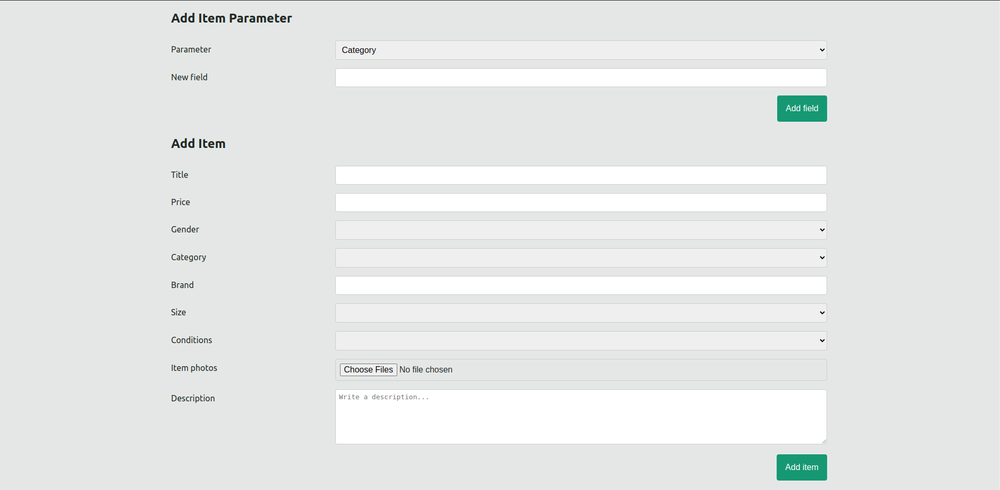
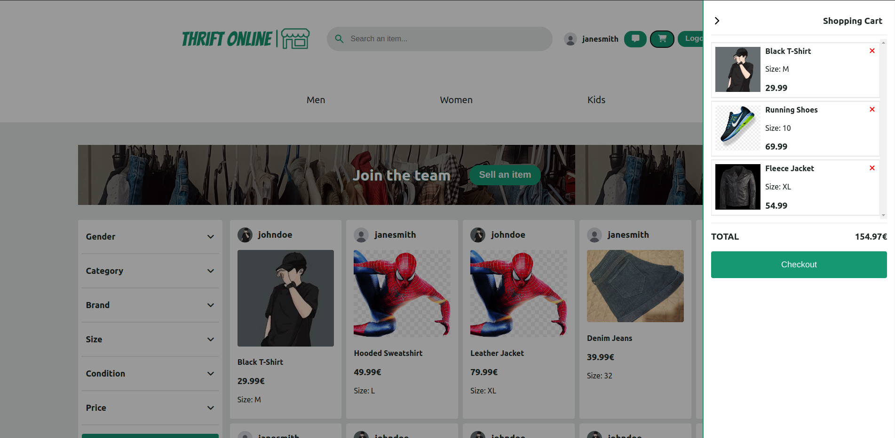

# Thrift Online

## Group ltw18g02

 - David Ranito (up202206312) 33%
 - Pedro João   (up202204962) 33%
 - Tiago Torres (up202208938) 33%

----
## Install Instructions
    sudo apt-get install php-gd
    git clone https://github.com/FEUP-LTW-2024/ltw-project-2024-ltw18g02
    git checkout final-delivery-v1
    sqlite3 database/database.db < database/database.sql
    php -S localhost:9000

----
## Credentials
* admin:password (admin)
* johndoe:password (user)
* janesmith:password (user)

----
## External Libraries:
  - GoogleFonts   
  - FontAwesome
  - php-gd

----
## Screenshots
  - Main page, with filter and chat
    
  - User profile
    
  - Add item and add new parameter (admin only)
    
  - Shopping Cart
    

----
## Implemented Features

   **General**:
   
   - [x] Register a new account.
   - [x] Log in and out.
   - [x] Edit their profile, including their name, username, password, and email.
   
   **Sellers**  should be able to:
   
   - [x] List new items, providing details such as category, brand, model, size, and condition, along with images.
   - [x] Track and manage their listed items.
   - [x] Respond to inquiries from buyers regarding their items and add further information if needed.
   - [ ] Print shipping forms for items that have been sold.
   
   **Buyers**  should be able to:
   
   - [x] Browse items using filters like category, price, and condition.
   - [x] Engage with sellers to ask questions or negotiate prices.
   - [x] Add items to a wishlist or shopping cart.
   - [x] Proceed to checkout with their shopping cart (simulate payment process).
   
   **Admins**  should be able to:
   
   - [x] Elevate a user to admin status.
   - [x] Introduce new item categories, sizes, conditions, and other pertinent entities.
   - [x] Oversee and ensure the smooth operation of the entire system.
  
   **Security**:
   We have been careful with the following security aspects:
   
   - [x] **SQL injection**
   - [x] **Cross-Site Scripting (XSS)**
   - [ ] **Cross-Site Request Forgery (CSRF)**

   **Password Storage Mechanism**: bcrypt hash_password&verify_password

   **Aditional Requirements**:
   
   We also implemented the following additional requirements:
   
   - [ ] **Rating and Review System**
   - [ ] **Promotional Features**
   - [ ] **Analytics Dashboard**
   - [ ] **Multi-Currency Support**
   - [ ] **Item Swapping**
   - [x] **API Integration**
   - [ ] **Dynamic Promotions**
   - [x] **User Preferences**
   - [x] **Shipping Costs**
   - [ ] **Real-Time Messaging System**

